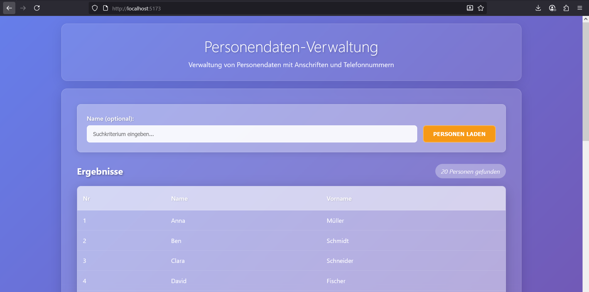
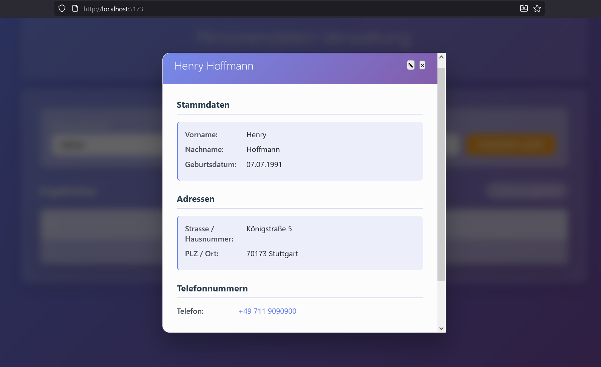

# 🧭 Task 2 – Webanwendung (Frontend + Backend)

Task 2 besteht aus einer modernen .NET-Webanwendung mit zwei Hauptkomponenten:

* 🧠 **Backend API** – ASP.NET Core + Entity Framework Core
* 🖥️ **Frontend** – Blazor Server
* 🗄️ **Datenbank** – `PeopleDb_Task2` (Migrationen werden beim Start des Backends automatisch ausgeführt)

---

## 🚀 Anwendung mit Docker starten (empfohlen)

```bash
cd docker
docker compose up -d --build
```

Nach dem erfolgreichen Start stehen folgende Endpunkte zur Verfügung:

| Komponente        | URL                                                          |
| ----------------- | ------------------------------------------------------------ |
| 🧠 Backend Health | [http://localhost:8080/health](http://localhost:8080/health) |
| 🧠 Backend Swagger | [http://localhost:8080/health](http://localhost:8080/swagger) |
| 🖥️ Frontend UI   | [http://localhost:5173](http://localhost:5173)               |

Zugang zu Frontend: [http://localhost:5173](http://localhost:5173)



---

## ⚙️ Konfiguration

### 🧠 Backend

Die Verbindungszeichenfolge zur Datenbank wird über Umgebungsvariablen im Docker-Container gesetzt:

```ini
ConnectionStrings__Default=Server=mssql;Database=PeopleDb_Task2;User Id=sa;Password=${MSSQL_SA_PASSWORD};TrustServerCertificate=True;Encrypt=False;
```

### 🖥️ Frontend

Das Frontend ruft das Backend über den internen Docker-DNS-Namen auf:

```ini
Backend__BaseUrl=http://backend:8080
```

---

## 💻 Lokale Entwicklung (optional)


### **SQL Server per Docker starten**  
1. Erstellen Sie eine `.env` Datei im `docker/` Verzeichnis:
```bash
cd docker
cp .env.example .env
```

2. Passen Sie das Passwort in der `.env` Datei an (optional):
```bash
# .env Datei
MSSQL_SA_PASSWORD="PeopleRegistry!1"
```

**Hinweis:** Wenn keine `.env` Datei vorhanden ist, wird automatisch das Default-Passwort `PeopleRegistry!1` verwendet.

3. Datenbank starten
```bash
docker compose -f docker-compose.database.yml up -d
```
Beim Hochfahren werden die Schemas/DBs `Task2_PeopleDb` erstellt.

---
### **Backend lokal starten**  

1. Die Verbindungszeichenfolge in `appsettings.Development.json` anpassen, falls Passwort anders als `PeopleRegistry!1` gesetzt wurde.

2. Backend starten:

Öffnen Sie ein neues Terminal:
```bash
# (Optional) Setze .ENV für Verbindung zum Datenbank
# Ggf. passen Sie das Passwort der Datenbank an.
export ConnectionStrings__Default='Server=localhost,1433;Database=PeopleDb_Task2;User Id=sa;Password=PeopleRegistry!1;Encrypt=False;TrustServerCertificate=True;'


# Run Backend 
cd task_2_webapp/src/backend/PeopleRegistry.Api
dotner restore
dotnet build
dotnet run
```

Nach dem Start ist die API-Dokumentation (Swagger) hier erreichbar:  
[http://localhost:5095/swagger](http://localhost:5095/swagger)

---
### **Frontend starten**:

   ```bash
   cd task_2_webapp/src/Frontend
   dotnet clean
   dotnet build
   dotnet run
   ```
Frontend ist dann erreichbar unter: [http://localhost:5161](http://localhost:5161)
> ⚠️ Stellen Sie sicher, dass `Backend:BaseUrl` in der Frontend-Konfiguration auf die richtige Backend-Adresse zeigt, z. B. `http://localhost:5095`.

---

## 🧭 Funktionsübersicht

Dieses Programm dient zur Verwaltung und Bearbeitung von Personendaten, einschließlich Adressen und Telefonverbindungen.
Im Folgenden sind die wichtigsten Funktionen der Anwendung beschrieben:

👤 **1. Personen Laden / Suchen**

Der Button „Personen Laden“ hat zwei Funktionen:

Laden: Ruft die gesamte Personenliste vom Backend ab und zeigt sie an.

Suchen: Wenn im Suchfeld ein Buchstabe oder Wort eingetragen ist, verhält sich der Button wie ein Suchwerkzeug. Es werden dann nur die Personen angezeigt, deren Namen das eingegebene Wort enthalten oder relevant sind.

Über dem Suchfeld und dem Button befindet sich ein Meldungsfeld, das den aktuellen Kommunikationsstatus mit dem Backend anzeigt (z. B. beim Laden oder Suchen).

🪄 **2. Personendialog**

Beim Anklicken einer Person in der Liste öffnet sich ein Personendialog.



✏️ **3. Bearbeiten & Schließen**

Oben links im Dialog befinden sich zwei Schaltflächen:

✏️ (Stift-Symbol): Aktiviert den Bearbeitungsmodus

❌ (X-Symbol): Schließt den Dialog

📝 **4. Bearbeitungsmodus**

Im Bearbeitungsmodus können alle Daten geändert werden.

Löschen ist derzeit nur für Telefonverbindungen und Anschriften möglich:

Über das ❌-Symbol in den jeweiligen Boxfeldern

Dieses erscheint, sobald der Bearbeitungsmodus aktiviert wurde

Am unteren Rand des Dialogs befinden sich:

- Speichern-Button

- Abbrechen-Button

Nach erfolgreichem Speichern erscheint eine Erfolgsmeldung, und der Dialog wird automatisch geschlossen.
