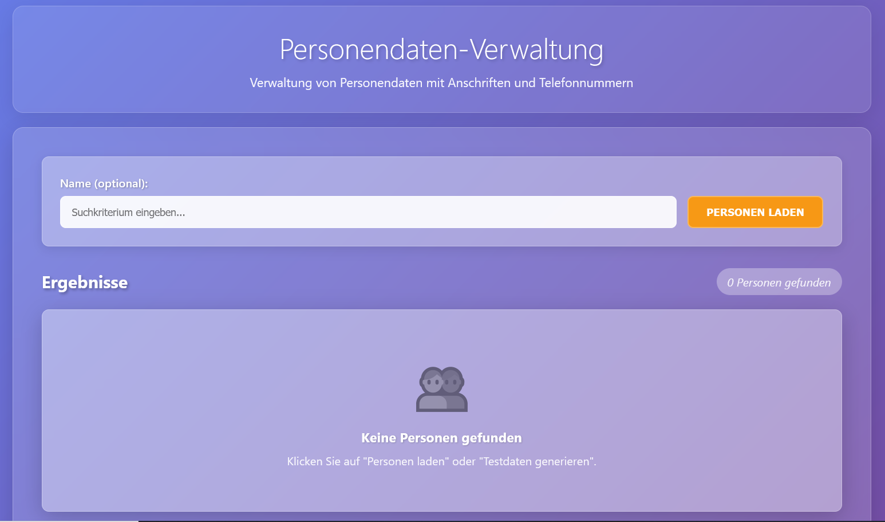

# 🧭 Task 2 – Webanwendung (Frontend + Backend)

Task 2 besteht aus einer modernen .NET-Webanwendung mit zwei Hauptkomponenten:

* 🧠 **Backend API** – ASP.NET Core + Entity Framework Core
* 🖥️ **Frontend** – Blazor Server
* 🗄️ **Datenbank** – `PeopleDb_Task2` (Migrationen werden beim Start des Backends automatisch ausgeführt)

---

## 🚀 Anwendung mit Docker starten (empfohlen)

```bash
cd docker
docker compose up -d --build
```

Nach dem erfolgreichen Start stehen folgende Endpunkte zur Verfügung:

| Komponente        | URL                                                          |
| ----------------- | ------------------------------------------------------------ |
| 🧠 Backend Health | [http://localhost:8080/health](http://localhost:8080/health) |
| 🧠 Backend Swagger | [http://localhost:8080/health](http://localhost:8080/swagger) |
| 🖥️ Frontend UI   | [http://localhost:5173](http://localhost:5173)               |

Zugang zu Frontend: [http://localhost:5173](http://localhost:5173)



---

## ⚙️ Konfiguration

### 🧠 Backend

Die Verbindungszeichenfolge zur Datenbank wird über Umgebungsvariablen im Docker-Container gesetzt:

```ini
ConnectionStrings__Default=Server=mssql;Database=PeopleDb_Task2;User Id=sa;Password=${MSSQL_SA_PASSWORD};TrustServerCertificate=True;Encrypt=False;
```

### 🖥️ Frontend

Das Frontend ruft das Backend über den internen Docker-DNS-Namen auf:

```ini
Backend__BaseUrl=http://backend:8080
```

---

## 💻 Lokale Entwicklung (optional)


### **SQL Server per Docker starten**  
1. Erstellen Sie eine `.env` Datei im `docker/` Verzeichnis:
```bash
cd docker
cp .env.example .env
```

2. Passen Sie das Passwort in der `.env` Datei an (optional):
```bash
# .env Datei
MSSQL_SA_PASSWORD="PeopleRegistry!1"
```

**Hinweis:** Wenn keine `.env` Datei vorhanden ist, wird automatisch das Default-Passwort `PeopleRegistry!1` verwendet.

3. Datenbank starten
```bash
docker compose -f docker-compose.database.yml up -d
```
Beim Hochfahren werden die Schemas/DBs `Task2_PeopleDb` erstellt.

---
### **Backend lokal starten**  

1. Die Verbindungszeichenfolge in `appsettings.Development.json` anpassen, falls Passwort anders als `PeopleRegistry!1` gesetzt wurde.

2. Backend starten:

Öffnen Sie ein neues Terminal:
```bash
# (Optional) Setze .ENV für Verbindung zum Datenbank
# Ggf. passen Sie das Passwort der Datenbank an.
export ConnectionStrings__Default='Server=localhost,1433;Database=PeopleDb_Task2;User Id=sa;Password=PeopleRegistry!1;Encrypt=False;TrustServerCertificate=True;'


# Run Backend 
cd task_2_webapp/src/backend/PeopleRegistry.Api
dotner restore
dotnet build
dotnet run
```

Nach dem Start ist die API-Dokumentation (Swagger) hier erreichbar:  
[http://localhost:5095/swagger](http://localhost:5095/swagger)

---
### **Frontend starten**:

   ```bash
   cd task_2_webapp/src/Frontend
   dotnet clean
   dotnet build
   dotnet run
   ```
Frontend ist dann erreichbar unter: [http://localhost:5161](http://localhost:5161)
> ⚠️ Stellen Sie sicher, dass `Backend:BaseUrl` in der Frontend-Konfiguration auf die richtige Backend-Adresse zeigt, z. B. `http://localhost:5095`.
